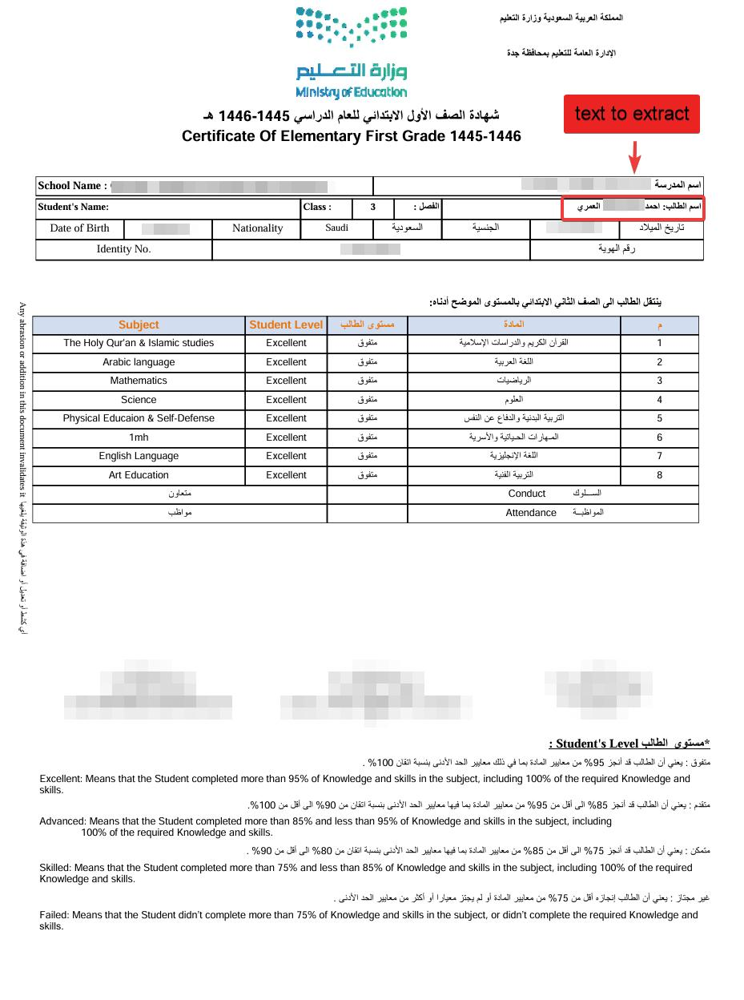
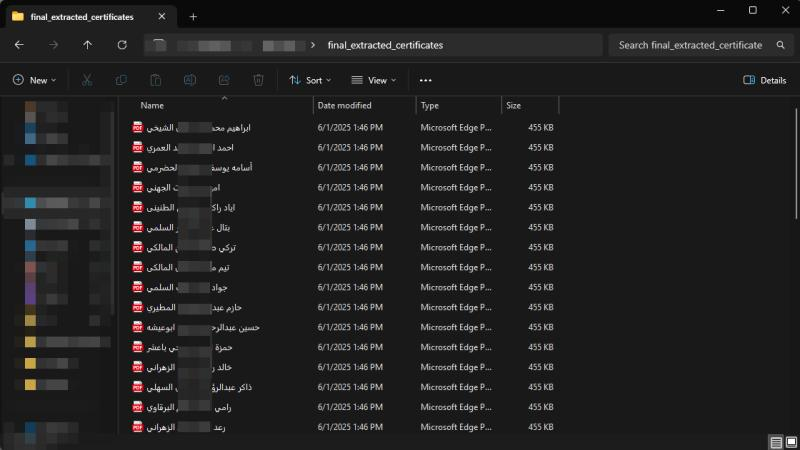

# Saudi Certificate Name Extractor (Arabic OCR)

This project extracts **Arabic student names** from official **Saudi Ministry of Education certificates (شهادات الطلاب)** and automatically saves each page as a **separate PDF** named after the detected student’s name.

It uses **Optical Character Recognition (OCR)** via **Tesseract** and **PyMuPDF** to detect Arabic text from the “اسم الطالب” field found on Saudi Ministry of Education certificate templates.

---

## 📸 Example Results

### 🧾 Original Certificate
This is the format used by the Saudi Ministry of Education:

### 📁 Final Extracted Certificates
Each student’s certificate is automatically detected, named, and saved:

---

## 🚀 Features

- Optimized for **Saudi Ministry of Education certificate layouts**
- Extracts **Arabic student names** with high OCR accuracy
- Automatically splits multi-page PDFs into **individual student PDFs**
- Automatically names each certificate file using the extracted name
- Works with **Google Colab**, **Windows**, **Linux**, and **macOS**

---

## ⚙️ Usage

Place your Ministry certificate PDF inside the certificates/ folder, e.g.:
certificates/students.pdf

Run the notebook or script

The extracted certificates will be saved inside:
final_extracted_certificates/

## 🔧 Configuration

If you need to fine-tune the extraction area (depending on your certificate layout),
adjust these coordinates in the script or notebook:

- EXTRACTION_X = 440
- EXTRACTION_Y = 155
- EXTRACTION_WIDTH = 250
- EXTRACTION_HEIGHT = 20

## 🧠 Technologies Used
- Python
- PyMuPDF (fitz)
- Pytesseract (OCR)
- Pillow (Image Processing)
- Regex & Logging

## 🏫 Notes

This tool is built specifically for Saudi Ministry of Education student certificates.

Layouts or formats from other entities may require coordinate adjustments.

Works best with high-resolution, non-scanned PDFs for accurate OCR.

